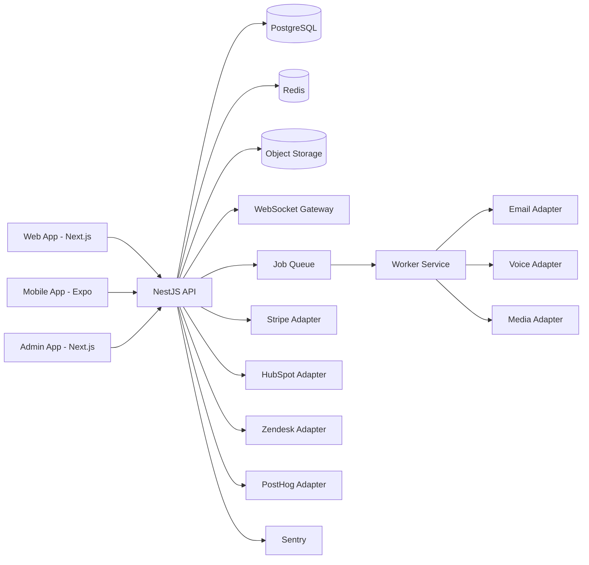

# MyHorrorStory Architecture Overview

## Platform Scope
MyHorrorStory is a cross-platform horror mystery service with synchronized remote gameplay, asynchronous progression, AI-assisted narrative delivery, and commercial operations tooling.

## Runtime Topology

## Monorepo Layout
- `apps/web`: customer marketing + gameplay interface.
- `apps/mobile`: mobile gameplay and notifications.
- `apps/api`: domain APIs, auth, realtime gateway, orchestration.
- `apps/worker`: background jobs for timed unlocks, media and email.
- `apps/admin`: moderation, content, operations and growth controls.
- `packages/*`: shared contracts, story engine, adapters, design system.

## Delivery Model
- Documentation and implementation progress tracked per phase in `docs/status/phase-XX.md`.
- Every phase requires explicit validation evidence before advancing.
